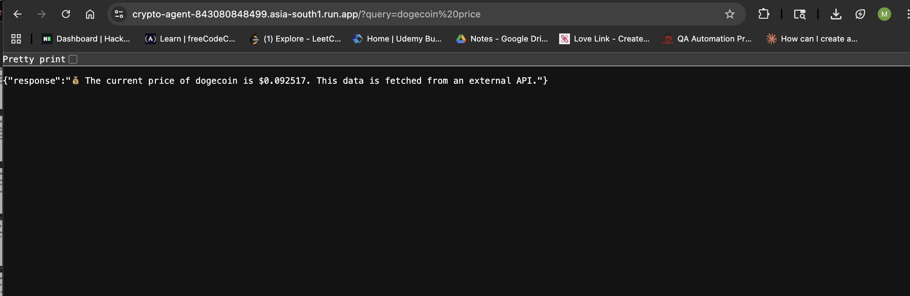

# 🤖 Crypto Agent

> 🏆 Built for a Connect AI Agents to Real-World Data Hackathon — Deployed on Cloud

An AI-powered crypto price agent built with **FastAPI**, following an **MCP-style tool-agent architecture**. The agent receives natural language queries, invokes an external tool (CoinGecko API) to fetch live cryptocurrency data, and returns intelligent responses in real time.

🔗 **Live Demo:** `https://crypto-agent-843080848499.asia-south1.run.app/?query=ethereumprice`

---

## 🧠 How It Works
```
User Query → Agent (decision unit) → Tool (CoinGecko API) → Response
```

- The **agent function** acts as the decision-making unit
- A **tool layer** (MCP-style) connects to CoinGecko's live API
- The agent invokes the tool to retrieve real-time price data
- A natural language response is generated and returned

---

## 🛠️ Tech Stack


| Layer | Technology |
|---|---|
| Agent Framework | Python (ADK pattern) |
| API Server | FastAPI |
| Data Source | CoinGecko REST API |
| Containerisation | Docker |
| Cloud Deployment | GCP Cloud Run |

---

## 🚀 Try It Live
```bash
# Ask about Bitcoin
curl "https://crypto-agent-843080848499.asia-south1.run.app/?query=bitcoin"

# Ask about Ethereum
curl "https://crypto-agent-843080848499.asia-south1.run.app/?query=ethereumprice"

# Ask about Dogecoin
curl "https://crypto-agent-843080848499.asia-south1.run.app/?query=dogecoin"
```

**Sample Response:**
```json
{
  "response": "💰 The current price of bitcoin is $83,452. This data is fetched from an external API."
}
```

---

## 🏃 Run Locally

### Prerequisites
- Python 3.8+
- Docker (optional)

### Without Docker
```bash
git clone https://github.com/MuskaanTimbadiya/crypto-agent.git
cd crypto-agent
pip install -r requirements.txt
uvicorn main:app --reload
```
Visit: `http://localhost:8000/?query=bitcoin price`

### With Docker
```bash
docker build -t crypto-agent .
docker run -p 8000:8000 crypto-agent
```

---

## 📁 Project Structure
```
crypto-agent/
├── main.py           # Agent logic + FastAPI endpoints + CoinGecko tool
├── Dockerfile        # Container setup
├── requirements.txt  # Dependencies
└── README.md
```

---

## 🔮 Future Improvements

- [ ] Support for 100+ coins via dynamic CoinGecko lookup
- [ ] Add price trend & 24h change to responses
- [ ] Natural language processing for richer query understanding
- [ ] Multi-coin portfolio queries
- [ ] WebSocket support for real-time price streaming

---

## 👩‍💻 Author

**Muskaan Timbadiya** — Senior QA Automation Engineer  
[](https://www.linkedin.com/in/muskaan-timbadiya/)


## 📸 Screenshots

### Live API Response

